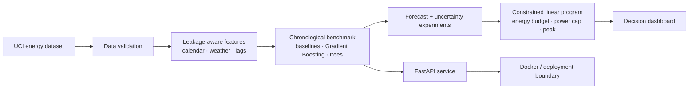

# GridWise AI

> **Forecast demand. Optimize operations. Make better energy decisions.**

<p align="center">
  <a href="https://github.com/hossiendehghan989/gridwise-ai/actions/workflows/ci.yml"></a>
  <a href="https://github.com/hossiendehghan989/gridwise-ai/blob/main/LICENSE"></a>
  
  
</p>

**GridWise AI** is an end-to-end energy decision-support system. It combines leakage-aware demand forecasting with constrained optimization to turn a prediction into a practical operating schedule.

The project is built for people who want to inspect the full path from **data → model → constraint → decision**. It is a research-grade portfolio implementation using the public UCI Appliances Energy Prediction dataset as a reproducible proxy for building and industrial telemetry.

> **Scope note:** this repository is a serious research prototype, not a claim of production readiness. Tariffs, carbon signals, and equipment constraints are illustrative and must be replaced and validated before operational use.

## Why it is different

Most forecasting projects stop at *“what will demand be?”* GridWise asks the next operational question:

> **Given the forecast, what action is feasible under real constraints?**

| Layer | What GridWise does |
| --- | --- |
| **Forecast** | Benchmarks baselines, Gradient Boosting, Extra Trees, and Random Forest on a chronological holdout. |
| **Trust** | Uses shifted lag features, explicit validation, multiple metrics, uncertainty experiments, and feature ablation. |
| **Optimize** | Solves a constrained linear program for flexible load, power caps, peak demand, price, and carbon signals. |
| **Deliver** | Provides a Streamlit decision dashboard, FastAPI endpoints, Docker support, tests, and GitHub Actions CI. |

## Validated results

The benchmark uses the final **20% of the time-ordered dataset** as an out-of-sample holdout. No random shuffling is used.

| Model | MAE (Wh) | RMSE (Wh) | R² | MAPE |
| --- | ---: | ---: | ---: | ---: |
| Naive: previous reading | 26.5 | 66.2 | 0.46 | 21.9% |
| **Gradient Boosting** | **29.2** | **62.0** | **0.53** | 26.8% |
| Naive: rolling mean | 34.1 | 75.1 | 0.31 | 28.9% |
| Extra Trees | 39.4 | 67.7 | 0.44 | 40.9% |
| Naive: same hour yesterday | 61.0 | 118.4 | -0.71 | 61.9% |
| Random Forest | 63.1 | 96.1 | -0.13 | 69.8% |

**Scheduling scenario:** the optimizer preserves a **1,200 Wh** flexible-energy budget and reduces the combined demand peak by **100 Wh** under a **300 Wh per-period cap**.

The benchmark is intentionally nuanced: the naive previous-reading baseline has lower MAE, while Gradient Boosting has the best RMSE and R². Model choice depends on the operational cost of different errors—not on a single leaderboard number.

## Architecture



## Quickstart

### 1. Install

```bash
git clone https://github.com/hossiendehghan989/gridwise-ai.git
cd gridwise-ai
python -m venv .venv
source .venv/bin/activate          # Windows: .venv\\Scripts\\activate
pip install -r requirements.txt
```

### 2. Download the reproducible dataset

```bash
python download_data.py
```

The data is downloaded from the [UCI Machine Learning Repository](https://archive.ics.uci.edu/dataset/374/appliances+energy+prediction) and stored locally under `data/` (ignored by Git).

### 3. Validate the implementation

```bash
pytest -q
python validate.py
```

### 4. Launch the dashboard

```bash
streamlit run dashboard.py
```

The dashboard exposes the benchmark, out-of-sample actual-versus-forecast behavior, and an interactive flexible-load scheduling scenario.

### 5. Run the API

```bash
uvicorn api:app --reload --port 8000
```

Then open [http://localhost:8000/docs](http://localhost:8000/docs). Available endpoints:

| Endpoint | Purpose |
| --- | --- |
| `GET /health` | Service and dataset health check |
| `GET /quality` | Dataset-quality validation; protected when `GRIDWISE_API_KEY` is configured |
| `POST /forecast` | Multi-horizon forecast; protected when `GRIDWISE_API_KEY` is configured |

## Research track

The repository also contains a deeper evaluation layer:

- expanding-window walk-forward evaluation
- quantile-style prediction intervals
- feature ablation
- scheduling sensitivity analysis
- split-conformal calibration
- annualized ROI and payback experiments
- deterministic retraining based on forecast degradation or feature drift
- scenario-based robust scheduling

Run the research experiments with:

```bash
python research_experiment.py
```

Selected observations are documented in [`RESEARCH_REPORT.md`](RESEARCH_REPORT.md). The current experiments reported **80.8% empirical coverage** for a nominal 80% interval with a mean width of 87.4 Wh. Removing historical lag features increased holdout RMSE from 62.0 Wh to 143.2 Wh on this dataset. These are dataset-specific observations, not universal claims.

## Project map

```text
.
├── dashboard.py                   # Streamlit decision interface
├── api.py                         # FastAPI health, quality, and forecast endpoints
├── download_data.py               # Reproducible public-data download
├── validate.py                    # Benchmark and optimization checks
├── research_experiment.py        # Walk-forward and sensitivity experiments
├── src/
│   ├── energy_optimizer.py        # Features, models, metrics, and scheduler
│   └── advanced.py                # Validation, intervals, explainability, robust scheduling
├── tests/                         # Unit tests for core behavior
├── .github/workflows/ci.yml       # Automated tests on push and pull request
├── Dockerfile                     # API container entry point
├── docker-compose.yml             # Local API service
├── PRODUCTION_GUIDE.md            # Deployment assumptions and safeguards
└── INTERVIEW_ANSWERS.md           # Technical design decisions and trade-offs
```

## Design decisions worth reviewing

### Leakage-aware features

Historical features are shifted before rolling statistics are calculated. This prevents the current target from entering its own predictors.

### Time-aware evaluation

The first 80% is used for training and the final 20% is reserved for evaluation. The same holdout is used across models and baselines so comparisons remain interpretable.

### Constrained optimization

For flexible load `x_t` and resulting peak `z`, the scheduler solves a linear program subject to:

```text
0 ≤ x_t ≤ maximum_power_per_period
Σ x_t = required_flexible_energy
forecast_demand_t + x_t ≤ z
```

This guarantees that the energy budget is conserved while making the peak/cost/carbon trade-off explicit.

## Roadmap

- [x] Leakage-aware feature engineering
- [x] Chronological model benchmark
- [x] Constrained scheduling baseline
- [x] Streamlit dashboard
- [x] FastAPI service and Docker entry point
- [x] Uncertainty, explainability, and robust-scheduling experiments
- [ ] Replace illustrative price and carbon vectors with live feeds
- [ ] Add probabilistic forecasting with production calibration monitoring
- [ ] Add equipment-level constraints and mixed-integer scheduling
- [ ] Add persisted experiment tracking and model registry
- [ ] Add drift monitoring and scheduled retraining workflow

Contributions that improve reproducibility, evaluation quality, documentation, or energy-domain realism are welcome. See [`CONTRIBUTING.md`](CONTRIBUTING.md).

## Honest limitations

- The dataset represents a home rather than a factory or grid asset.
- Price and carbon vectors in the dashboard are illustrative.
- The robust scheduler is scenario-based; it is not a full distributionally robust or mixed-integer industrial optimizer.
- The API safeguards improve defensibility but do not replace security review, secrets management, observability, or deployment hardening.

## License and citation

Released under the [MIT License](LICENSE). If you use the code or ideas, please cite the repository and the underlying [UCI Appliances Energy Prediction dataset](https://archive.ics.uci.edu/dataset/374/appliances+energy+prediction).

## Author

Built by [Hossein Dehghan](https://github.com/hossiendehghan989) at the intersection of **industrial engineering, applied AI, energy intelligence, and operational decision support**.
